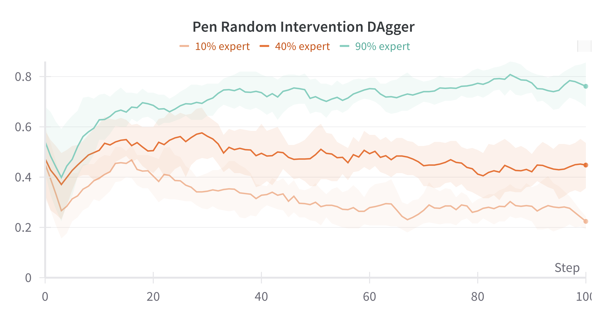
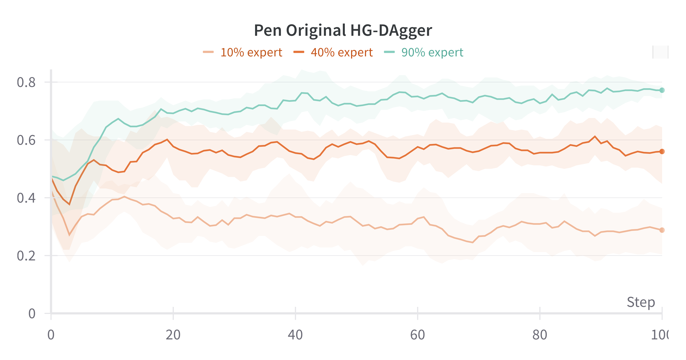
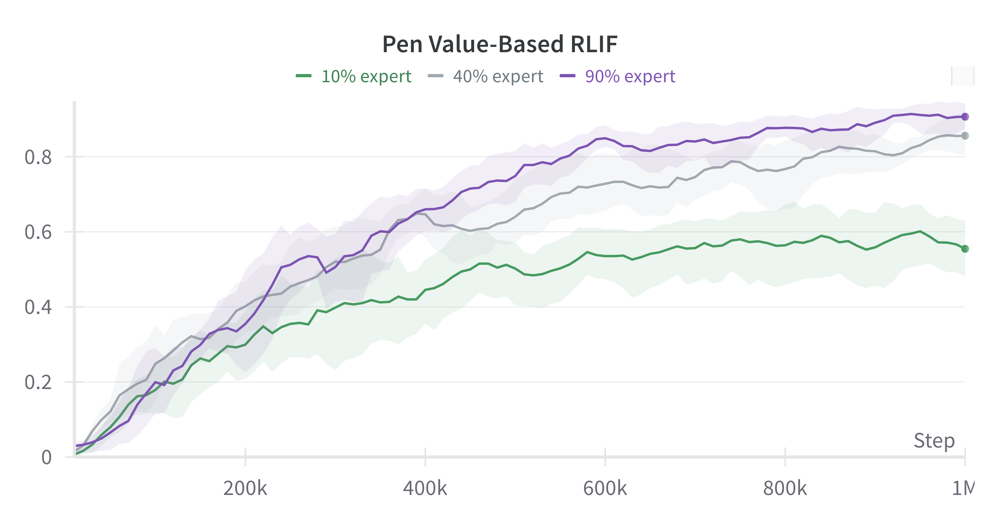
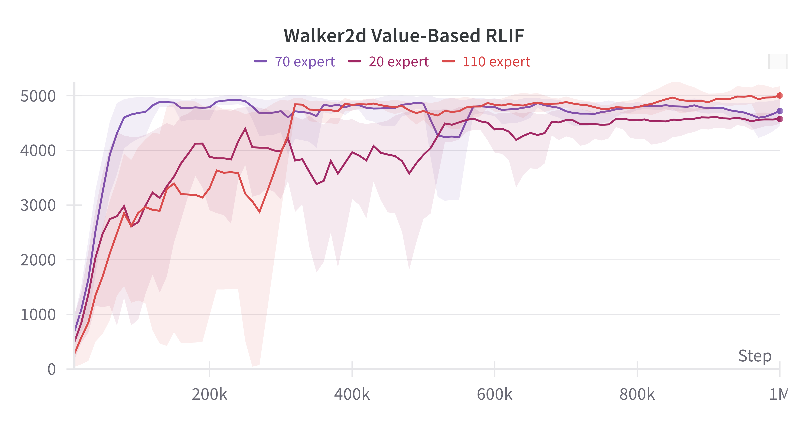
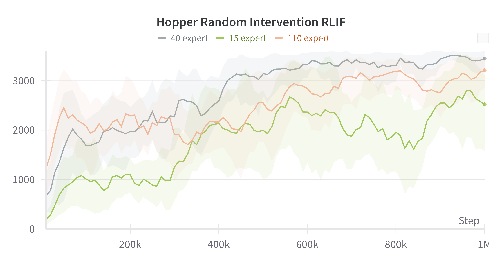

<h1><a href="https://arxiv.org/abs/2310.11731">RLIF: Interactive Imitation Learning as Reinforcement Learning</a></h1>
A simple and modular implementation of the <a href="https://arxiv.org/pdf/2311.12996.pdf">RLIF</a> algorithm in Jax and Flax. For more information, visit the website at <a href="rlif-page.github.io">rlif-page.github.io</a>.


## Installation

1. Install and use the included Ananconda environment
```
$ conda env create -f environment.yml
$ conda activate rlif
```
You'll need to [get your own MuJoCo key](https://www.roboti.us/license.html) if you want to use MuJoCo.

2. Add this repo directory to your `PYTHONPATH` environment variable.
```
export PYTHONPATH="$PYTHONPATH:$(pwd)"
```

## Datasets and Experts
The datasets used in this experiment can be found [here](https://drive.google.com/file/d/1-jybdj0vKF9Zp1OAdfiQBcMk-_F7aPBf/view?usp=sharing) and the expert agents can be found [here](https://drive.google.com/file/d/1UhT_Y-Nmxk67nGiwHTrD7lnQyaU0llB4/view?usp=sharing). 

For a more detailed breakdown of the experts, please visit this [page](https://docs.google.com/spreadsheets/d/1p6_GuzW3YHm4z-MNUJgztO3Uq8cNySWwJ9RV2A6buL0/edit?usp=sharing). 


## Run Experiments
This repository contains code for both value-based and random intervention strategies of RLIF and supports environments in D4RL(https://arxiv.org/abs/2004.07219).

To run the RLIF value-based intervention experiments, use the following command:
```
python3.8 -m RLIF.examples.train_rlif_main \
    --env_name "pen-expert-v1" \
    --sparse_env 'AdroitHandPenSparse-v1' \
    --dataset_dir 'ENTER DATASET DIR' \
    --expert_dir 'ENTER EXPERT DIR' \
    --ground_truth_agent_dir 'ENTER GROUND TRUTH AGENT DIR' \
    --logging.output_dir './experiment_output'
```
All available command options can be seen in examples/train_rlif_main.py.


To run the RLIF random intervention experiments, use the following command:
```
python3.8 -m RLIF.examples.train_rlif_random \
    --env_name "pen-expert-v1" \
    --sparse_env 'AdroitHandPenSparse-v1' \
    --dataset_dir 'ENTER DATASET DIR' \
    --expert_dir 'ENTER EXPERT DIR' \
    --ground_truth_agent_dir 'ENTER GROUND TRUTH AGENT DIR' \
    --logging.output_dir './experiment_output'
```
All available command options can be seen in examples/train_rlif_random_main.py.

This repository also contains code for DAgger, HD-DAgger, and an IQL baseline that runs in a DAgger-like setting. 

To run these experiments, use the following command:
```
python3.8 -m RLIF.examples.train_dagger_main \
    --env_name "pen-expert-v1" \
    --sparse_env 'AdroitHandPenSparse-v1' \
    --intervention_strategy 'ENTER INTERVENTION STRATEGY' \
    --dataset_dir 'ENTER DATASET DIR' \
    --expert_dir 'ENTER EXPERT DIR' \
    --ground_truth_agent_dir 'ENTER GROUND TRUTH AGENT DIR' \
    --logging.output_dir './experiment_output'
```
All available command options can be seen in examples/train_dagger_main.py.


## Weights and Biases Online Visualization Integration
This codebase logs experiment results to [W&B online visualization platform](https://wandb.ai/site). To log to W&B, you first need to set your W&B API key environment variable:
```
export WANDB_API_KEY='YOUR W&B API KEY HERE'
```
Then you can run experiments with W&B logging turned on:
```
python3.8 -m RLIF.examples.train_rlif_main \
    --env_name "pen-expert-v1" \
    --sparse_env 'AdroitHandPenSparse-v1' \
    --dataset_dir 'ENTER DATASET DIR' \
    --expert_dir 'ENTER EXPERT DIR' \
    --ground_truth_agent_dir 'ENTER GROUND TRUTH AGENT DIR' \
    --logging.output_dir './experiment_output' \
    --logging.online
```

## Example Runs

For full working examples, you can run a sweep of DAgger, HG-DAgger, value-based RLIF for Adroit Pen, value-based RLIF for Walker2d, and random intervention RLIF for Hopper using the following commands:
```
bash scripts/run_pen_dagger.sh
bash scripts/run_pen_hgdagger.sh
bash scripts/run_pen_value_based_rlif.sh
bash scripts/run_walker2d_value_based_rlif.sh
bash scripts/run_hopper_random_rlif.sh
```
This will generate the plots below.












## Citation BibTex

If you found this code useful, consider citing the following paper:
```
@misc{luo2023rlif,
      title={RLIF: Interactive Imitation Learning as Reinforcement Learning}, 
      author={Jianlan Luo and Perry Dong and Yuexiang Zhai and Yi Ma and Sergey Levine},
      year={2023},
      eprint={2311.12996},
      archivePrefix={arXiv},
      primaryClass={cs.AI}
}
```

## Credits
The implementation of RLIF builds on the original implementation of [RLPD](https://github.com/ikostrikov/rlpd) by Ilya Kostrikov and also adapts CQL and IQL from Xinyang Geng's [JaxCQL](https://github.com/young-geng/JaxCQL) and Ilya Kostrikov's [IQL](https://github.com/ikostrikov/implicit_q_learning), respectively. 
